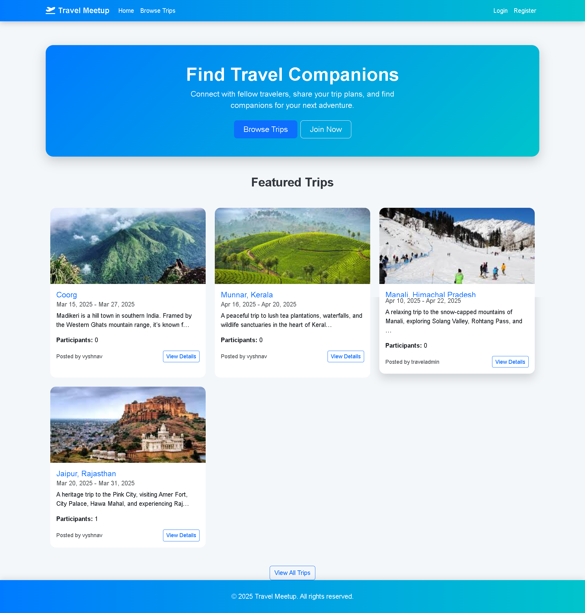

# Travel Buddy - Meet & Travel with Strangers

## Overview

Travel Buddy is a web application built using Python and Django that connects travelers with like-minded strangers who want to explore destinations together. Users can post their travel plans, search for others' trips, and join them. The platform also offers real-time messaging to facilitate communication between travelers.

## Features

- **User Authentication**: Secure sign-up and login functionality.
- **Post Trip Details**: Users can create trip posts with details such as destination, date, and budget.
- **Search for Trips**: Browse and search for trips posted by other users.
- **Join a Trip**: Request to join a travel plan and connect with like-minded travelers.
- **Real-Time Messaging**: Chat with trip organizers and other travelers in real time.
- **User Profile Management**: Update and manage user details.

## Tech Stack

- **Backend**: Python, Django
- **Frontend**: HTML, CSS, JavaScript
- **Database**: SQLite
- **Real-Time Communication**: Django Channels, WebSockets
- **Authentication**: Django Authentication System


  


  
## Installation & Setup

1. **Clone the Repository**

   ```bash
   git clone https://github.com/your-username/travel-buddy.git
   cd travel-buddy
   ```

2. **Create a Virtual Environment**

   ```bash
   python -m venv venv
   source venv/bin/activate   # On Windows use `venv\Scripts\activate`
   ```

3. **Install Dependencies**

   ```bash
   pip install -r requirements.txt
   ```

4. **Run Migrations**

   ```bash
   python manage.py migrate
   ```

5. **Create a Superuser** (for admin access)

   ```bash
   python manage.py createsuperuser
   ```

6. **Start the Development Server**

   ```bash
   python manage.py runserver
   ```

7. **Access the App**
   Open a browser and visit: [http://127.0.0.1:8000](http://127.0.0.1:8000)

## Usage

- **Sign up or log in** to create and manage your travel plans.
- **Post a trip** with destination, travel dates, and budget details.
- **Search for trips** using filters and keywords.
- **Request to join** a trip and wait for approval from the organizer.
- **Chat in real time** with fellow travelers before the journey.

## Future Enhancements

- Google Maps API integration for location-based trip discovery.
- Payment gateway integration for splitting costs.
- User reviews and ratings.
- AI-powered trip recommendations based on user interests.

## Contributing

Contributions are welcome! If you'd like to contribute, please contact the project owner.

## Contact

For any queries, feel free to reach out at vyshnams1\@gmail.com.


This repository is for viewing only. Cloning or using this code without permission is prohibited.
